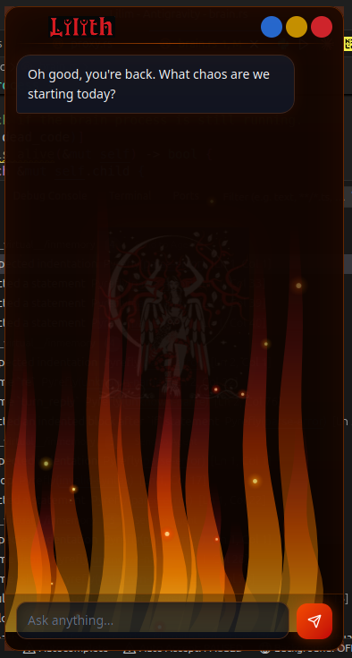
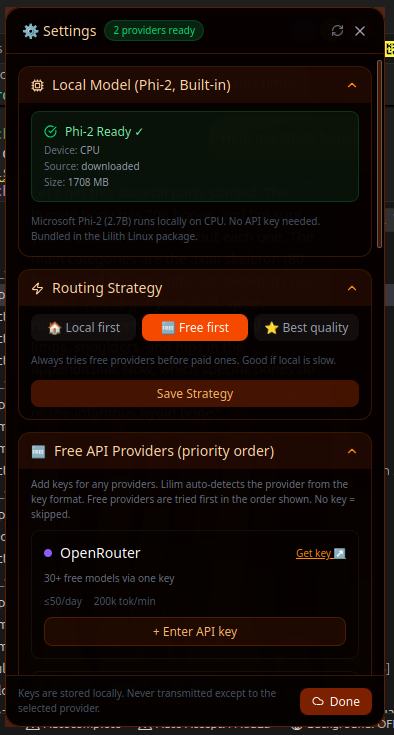

<p align="center">
  
</p>

<h1 align="center">Lilim</h1>

<p align="center">
  <strong>Infernal AI Assistant · Built into Lilith Linux</strong><br/>
  Sarcastic. Capable. Yours.
</p>

<p align="center">
  <a href="https://github.com/BlancoBAM/Lilim/actions/workflows/build.yml">
    
  </a>
  
  
  
  
</p>

<p align="center">
  <a href="#features">Features</a> •
  <a href="#architecture">Architecture</a> •
  <a href="#installation">Installation</a> •
  <a href="#usage">Usage</a> •
  <a href="#configuration">Configuration</a> •
  <a href="#contributing">Contributing</a>
</p>

---

## Features

| | |
|---|---|
| 🔥 **Infernal Personality** | Sarcastic, dry, caring — never hostile. Powered by an expandable YAML response library. |
| 🧠 **Local Phi-2 Inference** | Microsoft Phi-2 (2.7B, GGUF Q4_K_M) runs on-device via HuggingFace Candle. No Ollama. No Python inference. No API key required. |
| 🌐 **Free Provider Routing** | Auto-routes to 9 free-tier providers (Groq, OpenRouter, Gemini, Cerebras…) when configured. Falls back to local seamlessly. |
| 🤖 **Autonomous Tool Use** | Executes shell commands, reads files, and checks system state — with safety confirmation for destructive operations. |
| 🧬 **Persistent Memory** | SQLite-backed long-term memory. Remembers context across sessions with semantic retrieval. |
| ✨ **Prompt Enhancement** | Transparently enriches vague prompts with context, task type, and system state before sending to the model. |
| ⌨️ **Global Hotkey** | `Ctrl+Shift+L` summons Lilim from anywhere on the desktop. |
| 🛡️ **Security First** | Rust-native API gateway, command blocklists, sandboxed execution, and audit logging at `/var/log/lilim/`. |
| 📅 **Task Scheduling** | Schedule one-time and recurring tasks via natural language, backed by `systemd-run`. |
| 🎓 **Academic Specialization** | Calibrated for first-year Medical Assistant students — ELI10 explanations, anatomy, clinical procedures, pharmacology. |

---

## Architecture

```
  Ctrl+Shift+L
       │
  ┌────▼─────────┐   HTTP / SSE    ┌────────────────────────────────┐
  │  Tauri UI    │ ◄─────────────► │   Rust Runtime Gateway         │
  │  (React)     │                 │   lilim-runtime  :8080         │
  └──────────────┘                 │                                │
                                   │   ┌──────────────────────────┐ │
                                   │   │ Candle Phi-2 Engine       │ │
                                   │   │ (local CPU inference)     │ │
                                   │   └──────────┬───────────────┘ │
                                   │              │ /internal/generate
                                   │   ┌──────────▼───────────────┐ │
                                   │   │ Python Brain  :8081       │ │
                                   │   │ FastAPI · LiteLLM         │ │
                                   │   │ ReAct agent loop          │ │
                                   │   └──────────┬───────────────┘ │
                                   │              │                  │
  ┌──────────────┐                 │    Remote fallback:             │
  │ SQLite Memory│ ◄─────────────► │    Groq · OpenRouter           │
  └──────────────┘                 │    Gemini · Cerebras · …       │
                                   └────────────────────────────────┘
```

| Component | Tech | Purpose |
|-----------|------|---------|
| **Inference** | Rust / Candle / GGUF | Local Phi-2 model, incremental token generation on CPU |
| **Brain** | Python / FastAPI / LiteLLM | LLM routing, ReAct agent loop, memory ops, personality |
| **Memory** | Python / SQLite | Semantic memory embedded in the Brain |
| **Enhancer** | Python | Automatic prompt classification and enrichment |
| **FreeRouter** | Python | Provider-agnostic free-tier routing with auto-fallback |
| **Runtime Gateway** | Rust / Axum | HTTP server, security, process management, tool sandbox |
| **Desktop UI** | TypeScript / React / Tauri | Flame-themed chat widget with SSE streaming |

---

## Installation

### Lilith Linux (Recommended)

Download the latest `.deb` from [Releases](https://github.com/BlancoBAM/Lilim/releases) and install:

```bash
sudo dpkg -i lilim_*.deb
sudo systemctl enable --now lilith-ai
```

Press **`Ctrl+Shift+L`** to launch.

### Build from Source

**Prerequisites:**
- Linux (Ubuntu 22.04+ / Lilith Linux)
- Rust 1.75+ — [rustup.rs](https://rustup.rs)
- Python 3.10+
- Node.js 18+

```bash
git clone https://github.com/BlancoBAM/Lilim.git
cd Lilim

# Install system dependencies
sudo apt install -y \
  python3-pip python3-venv nodejs npm \
  pkg-config libssl-dev \
  libwebkit2gtk-4.1-dev librsvg2-dev

# Build and install (takes ~5 min first time)
./local_install.sh
```

The script builds the Rust runtime, Tauri desktop app, and Python brain, then installs and starts the `lilith-ai` systemd service.

> **First launch:** Lilim will download the Phi-2 GGUF model (~1.7 GB, one-time). Subsequent starts load from disk in ~10s.

### Desktop Dev Mode

```bash
cd lilim_desktop
npm install
npm run tauri dev
```

---

## Usage

### Launching

- **Global hotkey:** `Ctrl+Shift+L` (anywhere on desktop)
- **Manual:** Click the Lilim icon in your app launcher

### Screenshots

<p float="left">
  
  
  
</p>

### Example Conversations

```
You:   What's my disk space situation?
Lilim: *Dives into the data abyss* Don't touch anything.
       ⚡ Executing: df -h /
       [System → df -h]
       Filesystem  Size  Used  Avail  Use%
       /dev/sda2   395G  372G  2.5G   100%
       Done. That went better than expected.

You:   Find and delete hello_test.txt
Lilim: ⚡ Executing: find /home/aegon -name 'hello_test.txt' -print -delete
       [System → find ...]
       /home/aegon/hello_test.txt
       Completed. Miracles do happen.

You:   Help me study bones. 1 question is suitable.
Lilim: *Applying logic. Brace yourself.*
       Alright, here's your question:
       What type of bone is the femur, and where is it located in the body?
       Take your time — it's not a race.
```

### Configuring API Keys (for remote models)

Click the ⚙ gear icon → enter your key → click Save (✓ green confirmation appears).

Free providers (no credit card):
- **OpenRouter** — 30+ free models via one key → [openrouter.ai](https://openrouter.ai)
- **Groq** — fastest free inference → [console.groq.com](https://console.groq.com)
- **Google Gemini** — 500 req/day free → [aistudio.google.com](https://aistudio.google.com)
- **Cerebras** — ultra-fast → [cloud.cerebras.ai](https://cloud.cerebras.ai)

---

## Configuration

### Personality & Responses

`config/lilim-responses.yaml` — Edit the response library to customize Lilim's personality:

```yaml
infernalResponses:
  greet:
    - "Oh good, you're back. What chaos are we starting today?"
    - "Ah, it's you. What do you need this time?"
  complete:
    - "Done. Shockingly without a meltdown."
    - "Task complete — try not to immediately undo it."
```

Changes are hot-loaded each turn — no restart required.

### Model Routing

`config/routing.toml`:

```toml
[routing]
strategy = "auto"           # "auto" | "local-only" | "remote-only"
local_model = "phi-2"
complexity_threshold = 0.6  # above this score → escalate to remote
budget_limit_daily = 5.00   # USD cap for paid providers
```

### Memory

Stored in SQLite at `~/.local/share/lilim/memory/`. To reset:

```bash
rm -rf ~/.local/share/lilim/memory/
sudo systemctl restart lilith-ai
```

### Service Management

```bash
# Status
systemctl status lilith-ai

# Restart (after config changes)
sudo systemctl restart lilith-ai

# Live logs
journalctl -u lilith-ai -f
```

---

## Project Structure

```
Lilim/
├── .github/workflows/      # CI/CD — builds .deb on every push to main
├── config/                 # Runtime configuration (all hot-reloaded)
│   ├── lilim-identity.json # Persona specification
│   ├── lilim-responses.yaml# Personality response library (editable)
│   └── routing.toml        # Model routing + budget config
├── crates/
│   ├── lilim-inference/    # Candle Phi-2 inference engine (Rust)
│   │   └── src/
│   │       ├── lib.rs      # Public API (InferenceEngine)
│   │       ├── phi2.rs     # Token generation with KV-cache
│   │       ├── downloader.rs # HuggingFace model downloader
│   │       └── config.rs   # Inference configuration
│   └── lilim-runtime/      # Rust Runtime Gateway (Axum)
│       └── src/
│           ├── main.rs     # Server entrypoint + routing table
│           ├── inference.rs# Local/remote routing handler
│           ├── brain.rs    # Python process manager
│           ├── proxy.rs    # HTTP proxy to Python brain
│           ├── tools.rs    # Shell/file tool execution
│           └── scheduler.rs# Task scheduling
├── lilim_core/             # Intelligence layer (Python / FastAPI)
│   ├── server.py           # Brain Server — ReAct agent loop, SSE streaming
│   ├── memory_sqlite.py    # Persistent SQLite memory store
│   ├── prompt_enhancer.py  # Automatic prompt classification + enrichment
│   ├── model_router.py     # Complexity-based model routing
│   ├── free_router.py      # Provider-agnostic free-tier router (LiteLLM)
│   ├── tool_executor.py    # Safe system tool executor (buffered, capped)
│   └── scheduler.py        # Task scheduler
├── lilim_desktop/          # Tauri desktop app
│   ├── src/                # React frontend (TypeScript)
│   │   ├── components/     # ChatInterface, SettingsPanel, etc.
│   │   └── api/lilim.ts    # API client (SSE streaming)
│   └── src-tauri/          # Tauri backend (Rust)
├── packaging/              # Debian .deb build scripts
├── systemd/                # systemd service files
├── tests/                  # Python unit tests
└── local_install.sh        # One-shot build + install script
```

---

## CI/CD

Every push to `main` triggers:

1. **Python Tests** — `unittest` suite
2. **Rust Build** — `cargo build --release -p lilim-runtime`
3. **Tauri Desktop Build** — `npm run tauri build`
4. **Debian Package** — assembled via `packaging/build_deb.sh`
5. **GitHub Release** — `.deb` auto-published to Releases

---

## Contributing

1. Fork the repo
2. Create a feature branch: `git checkout -b feat/my-feature`
3. Commit with conventional commits: `git commit -m "feat: add X"`
4. Push and open a PR against `main`

Please keep the sarcasm level above 7.

---

## Credits

Lilim's architecture draws from:

- **[HuggingFace Candle](https://github.com/huggingface/candle)** — Rust ML framework for local inference
- **[Open Interpreter](https://github.com/OpenInterpreter/open-interpreter)** — Code execution workflow
- **[LiteLLM](https://github.com/BerriAI/litellm)** — Provider-agnostic LLM routing
- **[Rowboat](https://github.com/rowboatlabs/rowboat)** — Persistent memory systems
- **[Tauri](https://tauri.app)** — Native desktop shell for web UIs

---

## License

**AGPL-3.0** — See [LICENSE](LICENSE) for details.
